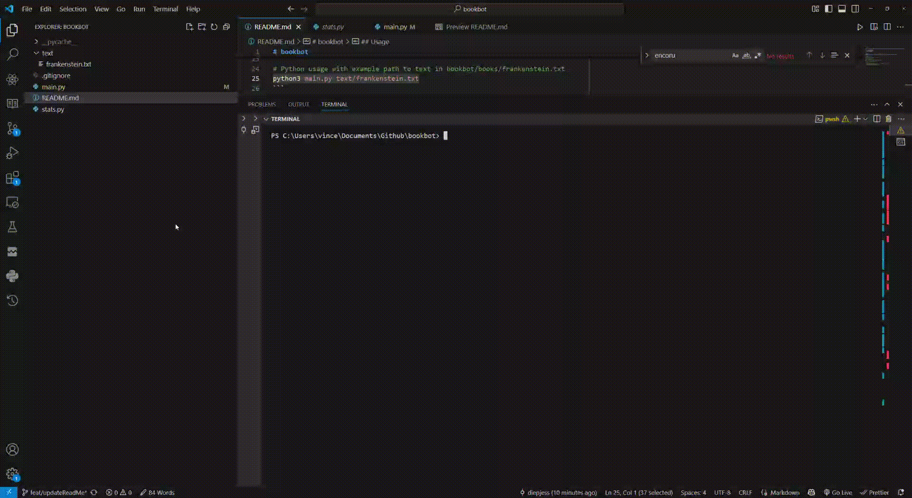

# bookbot

Bookbot is a simple command-line program that reads text from a file from provided book path and generates a report about the text.
- [bookbot](#bookbot)
  - [Boot.dev](#bootdev)
  - [Usage](#usage)



- [bookbot](#bookbot)
  - [Boot.dev](#bootdev)
  - [Usage](#usage)


## Boot.dev
BookBot is my first [Boot.dev](https://www.boot.dev) project! (Required for submission)

## Usage
```bash
# Open a terminal
# Ensure Git and Python3 is installed

# Clone the repository
git clone https://github.com/diepjess/bookbot

# Navigate to project directory
cd bookbot

# Python usage with example path to text in bookbot/books/frankenstein.txt
python3 main.py text/frankenstein.txt
```
